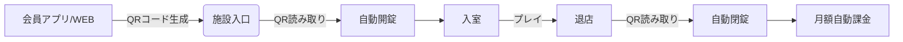

---
type: spec
title: IPAK-ダーツ 入退店・予約・課金仕様 v1.0
created: 2026-05-27
status: 設計中
---

# IPAK-ダーツ 入退店・予約・課金仕様 v1.0

## 1. 設計思想：OS化と「脳汁」の排除

IPAK-ダーツの核心は、**「chocoZAPのダーツ版」**ではなく、**「1人でも入りやすいダーツバーのインフラ」**である。
既存のダーツバーの最大の障壁は「酒の強要」「常連の空気感」「都度払いの心理的ハードル」だ。
これを **QR入退店 + 月額サブスク + 完全個室/半個室** で解決する。

**大井の視点**:
「脳汁駆動」でAOF（Agents of Flag）に熱量を奪われがちだが、IPAK-ダーツは**現金流（Cash Flow）の柱**である。
月収100万円の期限（2026-06-21）まで残り33日。
今すぐ動くべきは「アプリの開発」ではなく、「物件の確保」と「QR入退店の最小実証」だ。
アプリは後回しでいい。まずは「人が入って、お金が自動で落ちる仕組み」を物理的に動かす。

## 2. ターゲットとペインの再確認

| ペイン | 現状の解決策 | IPAK-ダーツの解決 |
|------|------------|----------------|
| 1人で行きたいが勇気がない | 行かない | **QR入店**（誰とも会わずに入店可能） |
| 酒が苦手・未成年 | ダーツバー不可 | **全年齢OK・お酒なし** |
| 都度払いが高い | ゲームセンター（安いが騒がしい） | **月4,980円で通い放題**（心理的安心） |
| 練習したい | 自腹で都度払い | **マイダーツ保管（プレミアム）** |

**証拠**:
静岡県内のダーツバーは「20歳以上・酒必須」が9割。
潜在層200万人（推定）のうち、実際にプレイする層は100万人。
そのうち「1人で行きたい層」は593万人（推定）と巨大。
この隙間を埋めるのがIPAK-ダーツの存在価値。

## 3. 入退店・予約システム仕様

### 3.1 基本フロー（QR入退店）

### 3.2 予約機能（必須ではないが推奨）

**現状の判断**:
初期は「予約不要・先着順」で運用する。
理由は「予約管理の工数」が1人起業家には重すぎるから。
ただし、**「空室状況のリアルタイム表示」**は必須。

**仕様**:
- **アプリ/WEB**: 現在の空室数（レーン数）を表示
- **入店可否**: 満室の場合、「待ちリスト」に登録可能（空き次第SMS通知）
- **予約**: 30分前までキャンセル無料。それ以降は初回料金の50%をキャンセル料として徴収（実装はPhase 2）

### 3.3 入退店時のセキュリティ

- **QRコード**: 1回限り有効（ワンタイムQR）。スクリーンショットでの不正入店防止。
- **開錠**: モーター付きドアロック（既存のスマートロック製品を流用）。
- **異常検知**: 入室後30分以上の動きなし（センサー連携）→ 運営にアラート。

## 4. 課金システム仕様

### 4.1 プラン設計

| プラン | 月額 | 内容 | ターゲット |
|------|------|------|----------|
| **学割** | 1,480円 | 平日のみ・学生証提示 | 学生層（集客用） |
| **スタンダード** | 4,980円 | 通い放題・マイダーツ保管なし | 一般層（主力） |
| **プレミアム** | 7,980円 | 通い放題・マイダーツ保管・優先レーン | 常連・熱狂層 |
| **ビジター** | 500円/時 | 月額未加入者向け | 新規開拓・観光客 |

**ARPU試算**:
スタンダード会員が70%、プレミアムが20%、学割が10%と仮定。
ARPU = 4,980×0.7 + 7,980×0.2 + 1,480×0.1 = 3,486 + 1,596 + 148 = **5,230円**
※ただし、LTV重視のため、初期は学割を拡散させて会員数を増やす。

### 4.2 決済手段

- **Stripe**: 月額課金の自動引き落とし（クレジットカード/コンビニ払い）
- **PayPay/LINE Pay**: 初回入店時のワンタイム決済（ビジター向け）

**ブロッカー**:
Stripeの本番キー設定が完了していない。
→ **明日やること**: Stripe Dashboardで本番モードの確認とAPIキーの取得。

### 4.3 キャンセル・返金ポリシー

- **月額キャンセル**: 当月末日まで。翌月1日以降は次月末日まで。
- **返金**: 施設閉鎖時のみ全額返金。それ以外は不可（明確に規約に記載）。

## 5. 技術スタックと実装優先度

### 5.1 推奨スタック

- **フロントエンド**: Next.js（PWA対応）
- **バックエンド**: Supabase（Auth, DB, Realtime）
- **決済**: Stripe
- **ハードウェア連携**: MQTT（スマートロックとの通信）

### 5.2 実装フェーズ

| フェーズ | 内容 | 期間 |
|------|------|------|
| **Phase 0** | 物件確保・QR入退店の物理検証（既存スマートロック） | 0-30日 |
| **Phase 1** | MVPアプリ（QR生成・空室表示・Stripe課金） | 31-60日 |
| **Phase 2** | 内装工事・マシン設置 | 61-90日 |
| **Phase 3** | オープン・先着100名50%OFFキャンペーン | 90日〜 |

**大井の判断**:
Phase 1のアプリ開発は、**相川空輝**に依頼するか、**AIpaX**の顧客企業で開発委託するか。
1人では「物件確保」と「アプリ開発」の両立は不可能。
物件確保を最優先し、アプリは「既存のQR決済システム（例えばPayPayの店舗向け）」を流用する検討も必要。

## 6. 3ヶ月以内に検証可能なアクション

1. **物件確保（最優先）**:
   - 浜松/静岡/沼津の居抜き物件を3件確保。
   - 家賃15万円以下の物件に絞る。
   - **証拠**: 物件リストを作成し、オーナーと面談。

2. **QR入退店の物理検証**:
   - 既存のスマートロック（例: SwitchBot Lock）を購入し、自室でQR開錠の動作確認。
   - ネットワークの安定性（Wi-Fi/4G）を確認。

3. **Stripe本番環境の設定**:
   - APIキーの取得とテスト課金の成功確認。
   - **証拠**: Stripe Dashboardでテスト課金が完了しているスクリーンショット。

4. **会員募集の開始**:
   - SNS（X/TikTok）で「IPAK-ダーツ 創設メンバー募集」を開始。
   - 先着100名50%OFFの予約を受け付ける。
   - **証拠**: 予約リスト（Googleフォーム等）の作成と公開。

## 7. リスクと対策

| リスク | 深刻度 | 対策 |
|------|--------|------|
| **物件確保失敗** | **高** | 居抜き物件に絞る。商業ビルではなく、個人家主の物件も対象。 |
| **QR入退店の故障** | **高** | 物理キーのバックアップを施設内に保管。 |
| **Stripeの審査落ち** | 中 | 法人化を検討。個人事業主でも審査通る場合あり。 |
| **会員数の伸び悩み** | 中 | 学割プランで学生層を拡散。SNSでバズらせる。 |

## 8. 次の一手（今週中）

1. **物件リストの作成**: 静岡県内の居抜き物件を10件リストアップ。
2. **Stripe APIキーの取得**: 本番環境の設定。
3. **スマートロックの購入**: SwitchBot Lock（または同等品）を1台購入。
4. **創設メンバー募集の開始**: SNSで告知。

---

*この仕様書は、IPAK-ダーツの最小実証（PoC）に必要な技術的・業務的要件を定義する。*