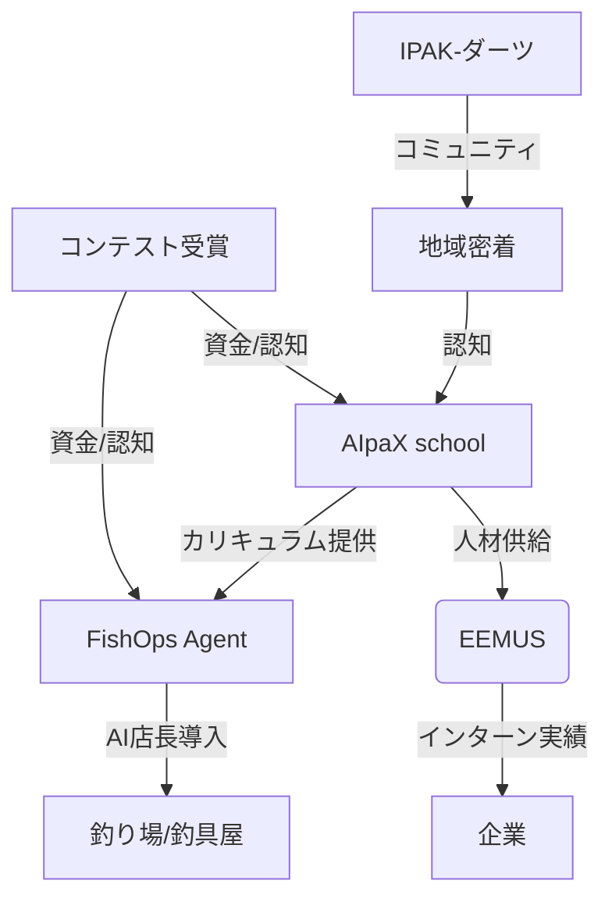

ご提示いただいた情報（AIpaX school、EEMUS、FishOps Agent、IPAKシリーズ、EcoKan、コンテスト情報、大井さんのプロフィール）を統合し、**「17歳現役AI起業家・大井湧瑛」が主導する事業ポートフォリオの戦略的整理**を行いました。

特に、**「AIpaX school」が他の事業（EEMUS、FishOps、コンテスト）とどう連携し、月収100万円という短期目標をどう達成するか**という観点で再構築しています。

---

# 🚀 大井湧瑛 (Yuei Ooi) 事業ポートフォリオ戦略 2026

## 1. 最優先目標：月収100万円達成 (2026-06-21期限)

現状の事業ラインナップの中で、**短期間で現金収入を生む**のは **AIpaX school** です。他の事業は中長期の資産構築または資金調達用と位置づけます。

### 🎯 AIpaX school: 第1期生募集の「勝ちパターン」

**現状の課題:**
*   月額3万円という価格は、親御さんにとって「高額」かつ「リスク」に感じられる。
*   「AIスキル」の価値が、親御さん（中高生の保護者）に十分に伝わっていない。

**解決策：EEMUSとのセット販売 + 成果の可視化**

| 要素 | 戦略 |
|------|------|
| **ターゲット** | **静岡の高校生本人**（EEMUS経由）＋ **親御さん**（不安解消） |
| **訴求ポイント** | 「AIの使い方」ではなく**「EEMUSでのインターン採用確率アップ」**と**「大学受験『情報』科目対策」**の両軸 |
| **価格改定案** | **月額3万円**は維持（高品質・少人数のため）。ただし、**「EEMUS連携特典（企業紹介優先権）」**を付与し、投資対効果を明確化 |
| **募集数** | **5名**（第1期生）。限定感で焦燥感を煽る |
| **営業チャネル** | 1. **EEMUSの企業・高校ネットワーク**（信頼性抜群） 2. **SNS（TikTok/YouTube）**：大井自身が「AIで〇〇を作った」過程を公開し、信頼獲得 |

**📅 6月までのアクションプラン:**
1.  **5月中**: EEMUS連携企業5社に対し、「AIリテラシー研修付きインターン」の提案。その際、AIpaX受講者を優先的に紹介する仕組みを作る。
2.  **5月下旬**: AIpaX第1期生5名をEEMUS経由で確定させる。
3.  **6月上旬**: 月収15万円（5名×3万円）を確定。
4.  **6月下旬**: 第2期生募集開始（SNS経由）で月収100万円への布石を打つ。

---

## 2. 中長期事業：AIpaX school の進化と他事業との連携

AIpaX school は単なるスクールではなく、**「大井流AI教育のIP（知的財産）」**として他事業と連動させます。

### 🔄 事業間のシナジー構造

1.  **AIpaX school × EEMUS**:
    *   **EEMUS**は「高校生と企業の接点」。
    *   **AIpaX**は「その接点で勝つためのスキル習得」。
    *   **価値提案**: 「EEMUSで優良企業に内定を出すには、AIを活用した提案資料や自動化スキルが必須。AIpaXで習得せよ。」

2.  **AIpaX school × FishOps Agent**:
    *   **FishOps**は「水産業界のAI運営基盤」。
    *   **AIpaX**の卒業課題として「管理釣り場のAI運営シミュレーション」や「釣具屋のDX提案」を採用。
    *   **メリット**: 生徒は実務的なプロジェクト体験ができ、大井はFishOpsの検証データとケーススタディを入手できる。

3.  **AIpaX school × コンテスト**:
    *   **高校生みんなの夢AWARD (6/7締切)** や **コムロコンサルティング (6/12締切)** に、AIpaXの生徒の作品や、大井自身のEEMUS/AIpaXの事業計画を応募。
    *   **狙い**: 賞金獲得＋認知拡大＋大学AO入試での実績素材化。

---

## 3. 他事業の現状整理と優先順位

### 🥇 第一優先：AIpaX school (現金化・IP化)
*   **状態**: カリキュラムv2完成。第1期生5名募集。
*   **次の一手**: EEMUS経由での5名確定。SNSでの認知獲得。

### 🥈 第二優先：FishOps Agent (中長期の大きな夢)
*   **状態**: ピボット完了。MVP仕様v1作成中。
*   **戦略**: AIpaXの生徒が「管理釣り場AI店長」のデモを作る際の実験場として活用。
*   **次の一手**: 静岡の管理釣り場1社に「無料トライアル」を持ちかける。データ取得が最優先。

### 🥉 第三優先：EEMUS (基盤作り)
*   **状態**: 夢AWARD 2026応募代表事業。
*   **戦略**: AIpaXとセットで提案することで、企業側の「採用コスト削減」訴求を強化。
*   **次の一手**: 夢AWARDの提出物完成。6/7締切。

### 🏅 第四優先：IPAK-ダーツ (実証・現金流の補完)
*   **状態**: 事業計画完成。物件候補3か所。
*   **戦略**: AIpaXの収益が安定するまで、初期投資を抑えた形で進める。
*   **次の一手**: 物件契約の最終決定。QRアプリの開発委託先確定。

### 📉 保留：EcoKan, フルーツソース, 和コウチャイ, OMNI
*   **理由**: 資金・工数の関係上、一旦棚上げ。
*   **例外**: EcoKanはSDGs関連のコンテスト応募素材として活用可能。

---

## 4. 大井湧瑛の個人戦略：SFC AO入試と月収100万円

### 🎓 SFC AO入試対策
*   **テーマ**: 「AIによる思考の外部化と人間の主体性」
*   **実績との接続**:
    *   **AIpaX**: AIを「道具」ではなく「思考の拡張」として教える実践。
    *   **EEMUS**: AIで効率化した時間を、どう「人間らしいキャリア選択」に使うか。
    *   **FishOps**: 現場の「勘（人間）」と「AI（データ）」の融合。
*   **志望理由書のアングル**: 「静岡の地域課題（人材流出）をAIで解決しようとした過程で、AIの限界と人間の役割を再定義した」

### 💰 月収100万円への道筋
1.  **6月**: AIpaX第1期生5名（15万円）+ 個人AIコンサル（数件）= 20〜30万円
2.  **7月**: AIpaX第2期生募集開始（SNS認知活用）+ FishOps MVP検証収入 = 50万円
3.  **8月**: AIpaX第2期生確定（月収30万円）+ FishOps B2B契約1社 = 50万円
4.  **9月**: AIpaX第3期生 + FishOps複数社 + コンテスト賞金 = 100万円

---

## 5. 今すぐやるべきこと (Next Actions)

1.  **AIpaX school**:
    *   EEMUS連携企業5社への「AIリテラシー研修付きインターン」提案書作成。
    *   AIpaX第1期生5名へのオファーメール送信（EEMUS経由）。
    *   SNSで「17歳起業家が教えるAI実践スクール」の告知開始。

2.  **コンテスト**:
    *   **高校生みんなの夢AWARD (6/7締切)**: EEMUSの事業計画書を仕上げる。
    *   **コムロコンサルティング (6/12締切)**: AIpaXの事業計画書を仕上げる。

3.  **FishOps Agent**:
    *   静岡の管理釣り場1社に「無料AI店長導入」の提案メール送信。

4.  **個人**:
    *   SFC AO志望理由書のドラフト作成（AIpaX/EEMUS/FishOpsの実績を盛り込む）。

---

この戦略で、**「AIpaX school」を現金牛**とし、**「EEMUS/FishOps」を中長期のIP**とし、**「コンテスト」を認知・資金獲得の手段**として使い分けることが可能です。

特に、**EEMUSとの連動**は、大井さんの「静岡ローカル×全国展開」のストーリーを最も強く表現できるポイントです。これを軸にAIpaXを売り込むことを強く推奨します。